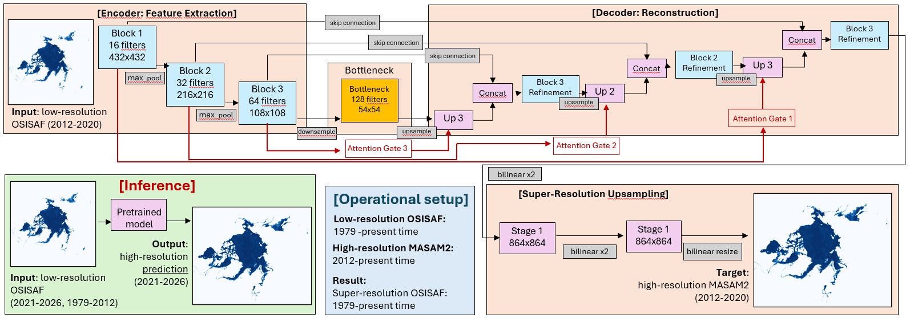
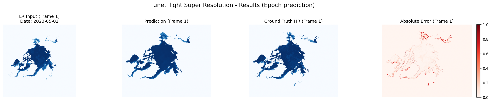
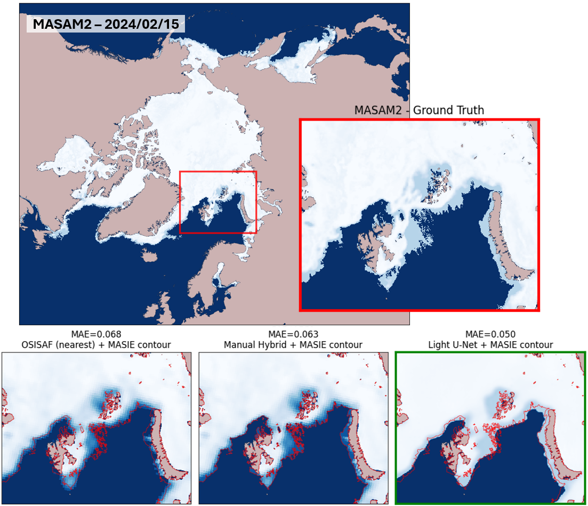

# Deep Learning for Super-Resolution of Sea Ice Concentration

This repository contains the official code and weights for **Deep Learning for Super-Resolution of Sea Ice Concentration: Case Study of OSISAF Down-Scaler**, originally submitted to the ICLR 2026 Machine Learning for Remote Sensing (ML4RS) Workshop. The current version extends the workshop implementation toward the IEEE GRSL journal submission with a cleaner structure, additional baselines, and updated documentation.

This work addresses the gap between long-term but coarse OSI SAF sea ice concentration records and high-resolution multi-sensor products such as MASAM2. We train a lightweight deep learning downscaler to transform OSI SAF fields from approximately **25 km** resolution into MASAM2-like **4 km** fields while learning finer ice-edge geometry and physically more consistent concentration patterns. After training, the model requires only OSI SAF input, enabling high-resolution reconstruction of historical Arctic sea ice concentration fields beyond the MASAM2 observation period.

## Model

The main model is `UNetLight`, a compact U-Net variant for single-channel sea ice concentration super-resolution. It uses three encoder blocks, a 128-channel bottleneck, skip-connected decoder blocks, and two additional bilinear upsampling stages before the final resize to the MASAM2 grid.

We also evaluate `AttentionUNet`, which keeps the same encoder-decoder backbone but adds attention gates to the skip connections. These gates filter encoder features before concatenation with decoder features, making the model heavier in computation and memory use. In our experiments, this extra complexity did not provide a meaningful overall improvement over `UNetLight`; therefore, the lightweight U-Net is the preferred approach and the main model used in this repository.

<p align="center">
  
  <br>
  <em>Figure 1. Light U-Net and Attention U-Net architectures and operational setup for OSISAF downscaling.</em>
</p>

## Results

### Single-date Prediction

Example output for 2023-05-01. The `UNetLight` model reconstructs a high-resolution MASAM2-like field from a coarse OSISAF input and reports the absolute error against the MASAM2 target.

<p align="center">
  
  <br>
  <em>Figure 2. Single-date Light U-Net prediction: low-resolution OSISAF input, model output, MASAM2 target, and absolute error.</em>
</p>

### Regional Method Comparison

The figure below compares classical interpolation, manual hybridization with MASIE contours, and the Light U-Net prediction in the same Arctic region. The Light U-Net result is highlighted in green. Its advantage is especially visible near Novaya Zemlya, where the model better preserves the ice-edge structure. The red line on each image is the ground-truth ice edge.

<p align="center">
  
  <br>
  <em>Figure 3. Regional method comparison against MASAM2 ground truth.</em>
</p>

### Aggregate Metrics

Metrics are computed against MASAM2. `UNetLight` matches the best MAE and SSIM while keeping the architecture simpler than `AttentionUNet`. Green cells mark the best value in a column, and blue cells mark the Light U-Net result.

<table>
  <thead>
    <tr>
      <th>Method</th>
      <th>BACC</th>
      <th>IIEE (x10<sup>5</sup>)</th>
      <th>MAE</th>
      <th>PSNR</th>
      <th>SSIM</th>
    </tr>
  </thead>
  <tbody>
    <tr>
      <td>Attention U-Net</td>
      <td>0.973 +/- 0.014</td>
      <td>0.500 +/- 0.117</td>
      <td>0.010 +/- 0.002</td>
      <td>23.01 +/- 1.06</td>
      <td bgcolor="#e8f5e9"><strong>0.961 +/- 0.008</strong></td>
    </tr>
    <tr>
      <td><strong>Light U-Net</strong></td>
      <td bgcolor="#e3f2fd"><strong>0.972 +/- 0.014</strong></td>
      <td bgcolor="#e3f2fd"><strong>0.521 +/- 0.118</strong></td>
      <td bgcolor="#e3f2fd"><strong>0.010 +/- 0.002</strong></td>
      <td bgcolor="#e3f2fd"><strong>22.94 +/- 1.12</strong></td>
      <td bgcolor="#e3f2fd"><strong>0.961 +/- 0.009</strong></td>
    </tr>
    <tr>
      <td>Bilinear</td>
      <td>0.780 +/- 0.026</td>
      <td>4.129 +/- 1.665</td>
      <td>0.071 +/- 0.029</td>
      <td>12.97 +/- 2.52</td>
      <td>0.879 +/- 0.041</td>
    </tr>
    <tr>
      <td>Bicubic</td>
      <td>0.778 +/- 0.025</td>
      <td>4.293 +/- 1.584</td>
      <td>0.073 +/- 0.028</td>
      <td>12.74 +/- 2.44</td>
      <td>0.874 +/- 0.039</td>
    </tr>
    <tr>
      <td>Nearest</td>
      <td>0.772 +/- 0.026</td>
      <td>4.299 +/- 1.574</td>
      <td>0.073 +/- 0.028</td>
      <td>12.64 +/- 2.45</td>
      <td>0.874 +/- 0.038</td>
    </tr>
    <tr>
      <td>Nearest (SCRIP)</td>
      <td>0.970 +/- 0.011</td>
      <td>0.582 +/- 0.130</td>
      <td>0.014 +/- 0.003</td>
      <td>22.26 +/- 1.28</td>
      <td>0.950 +/- 0.009</td>
    </tr>
    <tr>
      <td>Manual Hybrid</td>
      <td bgcolor="#e8f5e9"><strong>0.990 +/- 0.003</strong></td>
      <td bgcolor="#e8f5e9"><strong>0.218 +/- 0.072</strong></td>
      <td>0.012 +/- 0.003</td>
      <td bgcolor="#e8f5e9"><strong>23.06 +/- 1.43</strong></td>
      <td>0.956 +/- 0.011</td>
    </tr>
  </tbody>
</table>

## Repository Structure

```text
.
|-- data/                         # Example data and processed matrices
|   |-- OSISAF/                   # Low-resolution OSISAF .npy inputs
|   |-- MASAM2/                   # High-resolution MASAM2 .npy targets
|   |-- OSISAF_reproj_matrices/   # Reprojected OSISAF baseline arrays
|   |-- MASIE_reproj_matrices/    # Reprojected MASIE ice/no-ice masks
|   `-- ManualHybrid_reproj_matrices/ # OSISAF concentrations corrected by MASIE ice/no-ice masks
|-- download_data/                # MASAM2 download and NetCDF-to-NPY helpers
|-- media/                        # README figures and visual assets
|-- outputs/
|   |-- models/                   # Trained model weights
|   |-- predictions/              # Saved .npy and .png predictions
|   |-- figures/                  # Evaluation and comparison figures
|   `-- metrics/                  # JSON metric outputs
|-- src/
|   |-- models/                   # UNetLight, Attention U-Net, large U-Net
|   |-- preprocessing/            # Reprojection and manual hybrid baseline
|   |-- training/                 # Training scripts
|   |-- inference/                # Prediction, evaluation, interpolation baselines
|   |-- visualization/            # Plotting utilities
|   |-- config.py                 # Paths, splits, model registry
|   `-- dataset.py                # OSISAF/MASAM2 paired dataset
`-- pyproject.toml                # Python dependencies
```

## Running the Code

Install dependencies with `uv`:

```bash
uv sync
```

Data paths and date splits are configured in `src/config.py`. By default, the repository uses sequential date ranges:

```python
TRAIN_DATE_RANGE = ("20120701", "20201231")
VAL_DATE_RANGE = ("20210101", "20221231")
TEST_DATE_RANGE = ("20230101", "20250630")
```

### Train Light U-Net

```bash
uv run python src/training/unet_light_train.py
```

The script trains `UNetLight`, saves the best checkpoint to `outputs/models/unet_light_best.pth`, and exports final weights to `outputs/models/unet_light_final.pth`.

### Predict One Date

```bash
uv run python src/inference/predict_by_date.py --model unet_light --date 20230501
```

The command saves both the predicted matrix and a visual comparison under `outputs/predictions/unet_light/`.

### Evaluate a Trained Model

```bash
uv run python src/inference/evaluate_model.py --model unet_light
```

### Plot Regional Method Comparison

Generate the side-by-side regional comparison figure after the Light U-Net predictions, Attention U-Net predictions, OSISAF reprojection, MASIE reprojection, manual hybrid arrays, and MASAM2 targets are available:

```bash
uv run python src/visualization/maps_comparison.py --start 20230501 --end 20230501
```

The figure is saved to `outputs/figures/prediction_comparison_images/20230501_predictions.png`.

### Build Baselines

Reproject OSISAF NetCDF files:

```bash
uv run python src/preprocessing/osisaf_reproject.py
```

Build the manual hybrid baseline from OSISAF and MASIE matrices:

```bash
uv run python src/preprocessing/build_manual_hybrid.py
```

Evaluate interpolation baselines:

```bash
uv run python src/inference/interpolation_methods.py
```

## Citation
```
@inproceedings{
borisova2026deep,
title={Deep Learning for Super-resolution of Sea Ice Concentration: Case Study of {OSISAF} Downscaler},
author={Julia Borisova and Dmitry Morozov and Dmitry Gilemkhanov and Nikolay Nikitin},
booktitle={4th ICLR Workshop on Machine Learning for Remote Sensing (Main Track)},
year={2026},
url={https://openreview.net/forum?id=nLxgFdKi30}
}
```